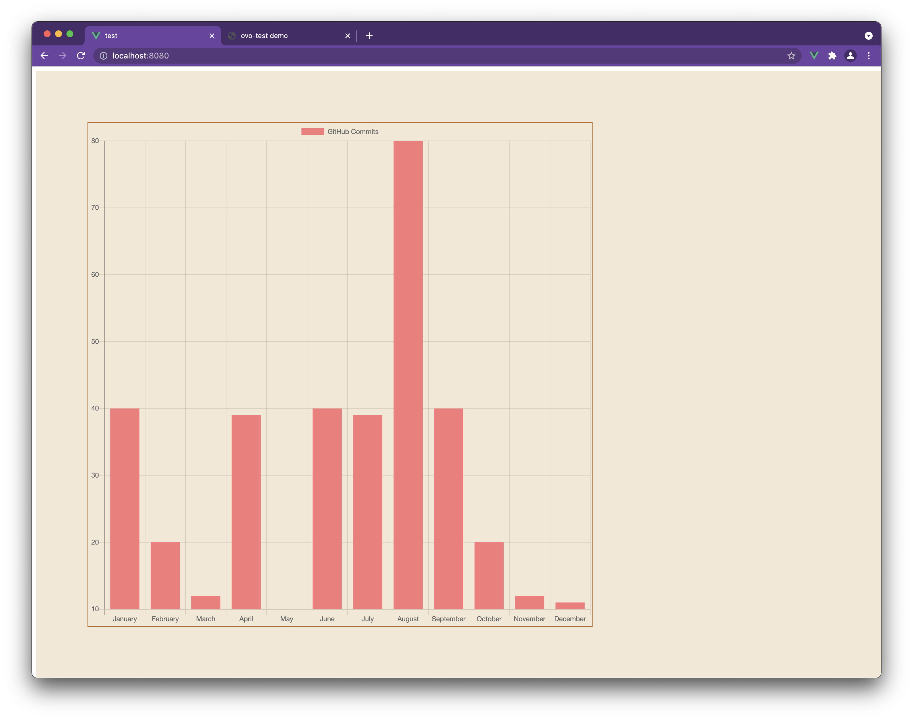
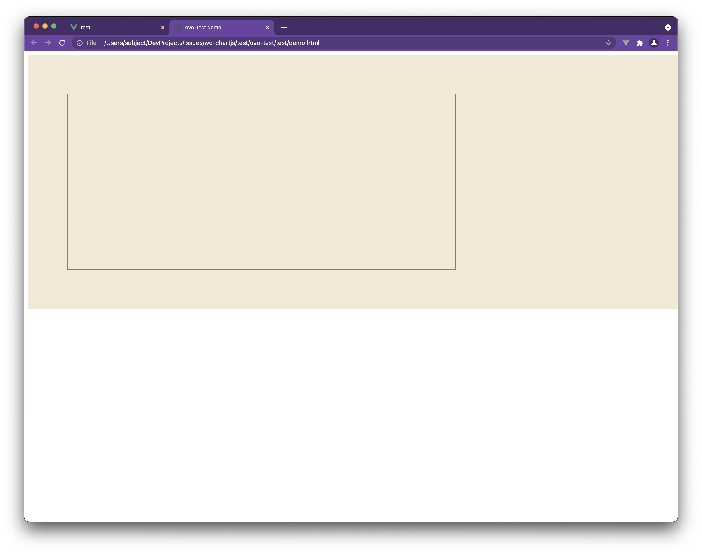

# chartjs-vue wc-repro

## Project setup

```bash
yarn install
```

### Setup reproduction assets

```bash
yarn repro
```

Then navigate to test/ovo-test/test/demo.html and observe:

- No chart
- Nothing in the console log that signifies failure

Expected result:



Actual result:


